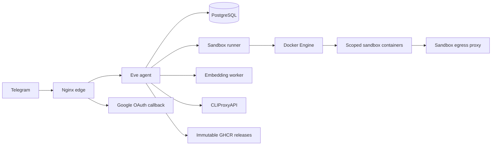

# Osinara

<p align="center">
  <strong>Семейный Telegram-агент с долговременной памятью, безопасными областями доступа и production-grade деплоем.</strong>
</p>

<p align="center">
  <a href="https://github.com/nyxandro/osinara/actions/workflows/ci-release.yaml"></a>
  <a href="https://github.com/nyxandro/osinara/releases/latest"></a>
  
  
  
</p>

<p align="center">
  <a href="#быстрый-старт"></a>
  <a href="#проверка"></a>
  <a href="docs/production-deployment.md"></a>
  <a href="https://github.com/nyxandro/osinara/releases"></a>
</p>

## Что Это

Osinara — приватный семейный Telegram-агент на TypeScript, Eve `0.22.5`, PostgreSQL, Groq Whisper, Docker Compose и нативных skills. Проект делает упор не на «чат-бота вообще», а на строгие границы между личным, семейным и внешним групповым контекстом.

Главная идея: пользователь может доверять агенту бытовые задачи, файлы, память, расписания и интеграции, при этом приложение не принимает идентичность, роли или область доступа из текста модели. Источники доверия — Telegram update, session auth и PostgreSQL.

## Возможности

| Блок | Что умеет |
| --- | --- |
| Telegram | Durable webhook ingress, быстрый ACK Telegram, FIFO-drain по chat/topic, rich replies, HITL callbacks. |
| Семья и группы | Bootstrap владельца, приглашения, подтверждение участников, owner-only операции, семейные и внешние группы. |
| Память | Личная, семейная и групповая long-term memory с поиском, экспортом, безопасной чувствительностью и отдельными scopes. |
| Расписания | Напоминания и автономные agent schedules: дайджесты, отчёты, регулярные сценарии и delivery в Telegram. |
| Голос | Groq Whisper transcription перед основным agent turn с повторной проверкой authorization. |
| Workspaces | Изолированные personal, family и group файловые области, attachment persistence, безопасная отправка файлов. |
| Google Workspace | Native `gws` skills для Gmail, Calendar, Drive, Docs, Sheets и People через workspace-bound OAuth credentials. |
| Sandbox | Долгоживущие Docker sandbox sessions с scoped mounts, isolated tools volume, egress proxy и fail-closed policy. |
| Production | Immutable GitHub releases, GHCR digest images, Telegram approval перед deploy, systemd timer на сервере. |

## Архитектура



## Trust Zones

| Область | Память | Workspace | Tools |
| --- | --- | --- | --- |
| Личный чат | `personal` и `family` | `/workspace/personal`, `/workspace/family` | Полный trusted sandbox, personal tools environment. |
| Семейная группа | Только `family` | `/workspace/family` | Trusted sandbox, family tools environment. |
| Внешняя группа | Только `group` | `/workspace/group` | Без Bash, сети и persistent credentials; только безопасные file tools. |

## Production Flow

1. PR проходит `docker compose -f compose.test.yaml up --build --abort-on-container-exit --exit-code-from tests`.
2. Merge в `main` запускает GitHub Actions `CI and release`.
3. Workflow собирает шесть production images и публикует immutable release `vX.Y.Z`.
4. Osinara создаёт Telegram proposal владельцу на обновление.
5. Только после owner approval серверный `/opt/osinara/bin/production-deploy.sh` забирает release.
6. Deploy script проверяет manifest, digest images, Compose hash, backups, migrations и health endpoint.

Подробнее: [`docs/production-deployment.md`](docs/production-deployment.md).

## Быстрый Старт

### Требования

| Runtime | Версия |
| --- | --- |
| Node.js | `24.x` |
| npm | из Node `24.x` |
| Docker | Docker Engine + Compose v2 |
| PostgreSQL | через Compose, `pgvector/pgvector:pg17` |

### Установка

```bash
npm ci
```

`postinstall` применяет локальные Eve patches. Если patch mismatch падает, это намеренная защита от незамеченного изменения Eve internals.

### Локальная конфигурация

Создайте `.env` с обязательными секретами и environment-specific значениями. Проект намеренно не подставляет business fallback values для required config.

Минимально для локального Compose нужны:

```dotenv
POSTGRES_PASSWORD=
CLI_PROXY_API_KEY=
MODEL_UPSTREAM_API_KEY=
GROQ_API_KEY=
INVITATION_SIGNING_SECRET=
TELEGRAM_BOT_TOKEN=
TELEGRAM_BOT_USERNAME=
TELEGRAM_WEBHOOK_SECRET_TOKEN=
```

Для Google Workspace OAuth дополнительно нужны:

```dotenv
GOOGLE_OAUTH_CLIENT_ID=
GOOGLE_OAUTH_CLIENT_SECRET=
INTEGRATION_TOKEN_ENCRYPTION_KEY=
PUBLIC_BASE_URL=
```

### Запуск

```bash
docker compose up --build
```

Локальный edge слушает `http://localhost:8080` и публикует только разрешённые маршруты из `infra/nginx.conf`.

## Проверка

Быстрый локальный набор:

```bash
npm run typecheck
npm test
npm run build
```

Runtime bundle для workers и sandbox services:

```bash
npm run build:runtime
```

Главная production-equivalent проверка:

```bash
docker compose -f compose.test.yaml up --build --abort-on-container-exit --exit-code-from tests
```

## Структура

| Путь | Назначение |
| --- | --- |
| `agent/agent.ts` | Root Eve agent: model, compaction, delegation limits. |
| `agent/channels/telegram.ts` | Telegram channel, durable ingress, HITL, rich delivery. |
| `agent/tools/` | Model-facing typed tools. Не класть сюда tests. |
| `agent/skills/` | Native Eve skills, включая Google Workspace, docs, PDF, XLSX и browser. |
| `agent/lib/` | Application logic, repositories, policies и colocated tests. |
| `agent/schedules/` | Nitro/Eve schedules: reminders, agent schedules, software update checks. |
| `services/sandbox-runner/` | Docker-backed sandbox lifecycle, mounts, process execution, policy versions. |
| `services/sandbox-egress-proxy/` | Network boundary для trusted sandbox egress. |
| `migrations/` | PostgreSQL schema migrations. |
| `scripts/` | Migration runner, workers, bootstrap, Eve patches, production deployment helpers. |
| `compose.yaml` | Local Docker Compose graph. |
| `compose.production.yaml` | Source template для immutable production release assets. |
| `infra/nginx.conf` | Public edge allowlist. |

## Security Notes

- Authorization is application-owned, not prompt-owned.
- Telegram identity, family, group type, roles and scopes never come from model text.
- Missing required config fails fast with stable errors.
- External groups cannot access personal/family memory, credentials, Bash, network or trusted tools.
- Production images are built only by GitHub Actions from canonical `main` state.
- Production deployment requires Telegram owner approval and exact release manifest validation.
- Sandbox credentials are mounted by workspace scope and kept outside model-visible text.

## Skills

Active skills are committed under `agent/skills` and loaded by Eve on demand. Runtime sessions do not mutate the skill catalog or install new production skills.

Highlighted skill groups:

| Skill group | Examples |
| --- | --- |
| Google Workspace | `gws-gmail`, `gws-calendar`, `gws-drive`, `gws-docs`, `gws-sheets`, `gws-people`. |
| Documents | `pdf`, `docx`, `xlsx`. |
| Browser and research | `agent-browser`, `find-docs`, `find-skills`. |
| Personalization | `behavior-preferences`. |

## Release Badges

<p>
  
  
  
  
  
</p>
