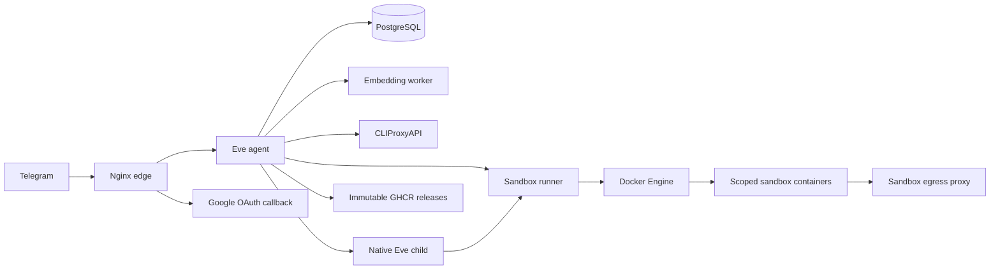

# Osinara

<p align="center">
  <strong>Семейный Telegram-агент с долговременной памятью, безопасными областями доступа и production-grade деплоем.</strong>
</p>

<p align="center">
  <a href="https://github.com/nyxandro/osinara/actions/workflows/ci-release.yaml"></a>
  <a href="https://github.com/nyxandro/osinara/releases/latest"></a>
  
  
  
</p>

<p align="center">
  <a href="#быстрый-старт"></a>
  <a href="#проверка"></a>
  <a href="docs/production-deployment.md"></a>
  <a href="https://github.com/nyxandro/osinara/releases"></a>
</p>

## Что Это

Osinara — приватный семейный Telegram-агент на TypeScript, Eve `0.32.0`, PostgreSQL, Groq Whisper, Docker Compose и нативных skills. Проект делает упор не на «чат-бота вообще», а на строгие границы между личным, семейным и внешним групповым контекстом.

Главная идея: пользователь может доверять агенту бытовые задачи, файлы, память, расписания и интеграции, при этом приложение не принимает идентичность, роли или область доступа из текста модели. Источники доверия — Telegram update, session auth и PostgreSQL.

## Возможности

| Блок | Что умеет |
| --- | --- |
| Telegram | Durable webhook ingress, быстрый ACK Telegram, FIFO-drain по chat/topic, обычные и rich replies, HITL callbacks. |
| Семья и группы | Bootstrap владельца, приглашения, подтверждение участников, owner-only операции, семейные и внешние группы. |
| Память | Root-agent source-backed writes, atomic memory threads, локальный hybrid retrieval, экспорт, HITL для sensitive data и отдельные scopes. |
| Расписания | Напоминания и автономные agent schedules: личные и семейные сценарии, а также owner-approved отчёты во внешние группы с отдельной fresh session, минимальным capability allowlist и bounded snapshot истории. |
| Голос | Groq Whisper transcription перед основным agent turn с повторной проверкой authorization. |
| Workspaces | Изолированные personal, family и group файловые области, attachment persistence, безопасная отправка файлов. |
| Изображения | Root-agent создаёт одно WebP через `gpt-image-2`, сохраняет его в authorized workspace и доставляет в Telegram без скрытых повторов; внешней группе capability выдаёт владелец из личного чата. |
| Google Workspace | Native `gws` skills для Gmail, Calendar, Drive, Docs, Sheets и People через workspace-bound OAuth credentials. |
| Sandbox | Долгоживущие Docker sandbox sessions с scoped mounts, isolated tools volume, egress proxy и fail-closed policy. |
| Оркестрация | В trusted private/family режимах root-agent делегирует большие задачи нативному Eve `agent` со свежим контекстом и теми же разрешёнными tools, skills, connections, sandbox и workspace; во внешних группах child delegation запрещена. |
| Production | Immutable GitHub releases, GHCR digest images, Telegram approval перед deploy, systemd timer на сервере. |

## Архитектура


```mermaid
flowchart LR
  Telegram[Telegram] --> Edge[Nginx edge]
  Edge --> Agent[Eve agent]
  Edge --> OAuth[Google OAuth callback]
  Agent --> Postgres[(PostgreSQL)]
  Agent --> Runner[Sandbox runner]
  Agent --> Memory[Embedding worker]
  Agent --> CLIProxy[CLIProxyAPI]
  Agent --> Child[Native Eve child]
  Child --> Runner
  Runner --> Docker[Docker Engine]
  Docker --> Sandbox[Scoped sandbox containers]
  Sandbox --> Egress[Sandbox egress proxy]
  Agent --> GHCR[Immutable GHCR releases]
```

## Trust Zones

| Область | Память | Workspace | Tools |
| --- | --- | --- | --- |
| Личный чат | `personal` и `family` | `/workspace/personal`, `/workspace/family` | Полный trusted sandbox и personal tools environment; при активной Codex-подписке root-agent может создавать изображения. |
| Семейная группа | Только `family` | `/workspace/family` | Trusted sandbox и family tools environment; при активной Codex-подписке root-agent может создавать изображения. |
| Внешняя группа | Только `group` | `/workspace/group` | Без Bash, произвольного сетевого доступа и persistent credentials; `web_fetch` и `generate_image` доступны только через отдельные owner grants, причём `generate_image` предлагается владельцу лишь при активном provider `codex-subscription`; безопасные file tools и настраиваемый импорт UTF-8 TXT/MD/JSON/CSV/TSV/HTML/XML/YAML/YML из Telegram. |
| Native child | Та же проверенная identity и scopes, что у parent turn | Тот же разрешённый workspace и sandbox | Тот же trust-zone surface, кроме root-owned `remember` и `generate_image`; отдельные history и state. |

## Production Flow

1. PR проходит `docker compose -f compose.test.yaml up --build --abort-on-container-exit --exit-code-from tests`.
2. Merge в `main` запускает GitHub Actions `CI and release`.
3. Workflow собирает шесть production images и публикует immutable release `vX.Y.Z`.
4. Osinara создаёт Telegram proposal владельцу на обновление.
5. Только после owner approval серверный `/opt/osinara/bin/production-deploy.sh` забирает release.
6. Deploy script проверяет manifest, digest images, Compose hash, backups, migrations и health endpoint.

Подробнее: [`docs/production-deployment.md`](docs/production-deployment.md).

Архитектура canonical и task sessions для Telegram-групп:
[`docs/group-session-architecture.md`](docs/group-session-architecture.md).

Полная спецификация памяти: [`docs/memory-system-full.md`](docs/memory-system-full.md).

## Быстрый Старт

### Self-hosted установка

Для чистого GNU/Linux x86_64 сервера на glibc с Docker Engine и Compose v2 загрузите `install.sh`
из immutable GitHub Release и передайте ему URL CLI asset и SHA-256 из того же release. Текущий
`osinara-linux-x64` собирается из glibc-варианта Node.js SEA и не поддерживает musl/Alpine Linux:

```bash
sudo ./install.sh \
  https://github.com/nyxandro/osinara/releases/download/v0.15.2/osinara-linux-x64 \
  <SHA-256 из osinara-linux-x64.sha256>
```

Установщик потребует свободные порты `80`, `443` и `8082`, проверит чистое состояние
`/opt/osinara` и production Docker resources, предложит `sslip.io` или собственный домен,
проверит Telegram и модель, затем запустит digest-pinned images, HTTPS и webhook. После успеха
проверенный CLI устанавливается как `/usr/local/bin/osinara` до изменения application state, поэтому
остаётся доступен для диагностики даже при неоднозначном завершении первичной установки.
Если установка дошла до webhook, но не показала ссылку владельца, после `osinara doctor` выполните
`sudo osinara owner-bootstrap`: предыдущий активный код будет отозван, новый действует 15 минут.

Bridge-релиз `v0.15.2` не включает новый пятиобразный auto-update controller для fresh install.
Он будет добавлен отдельным cutover-релизом; до него обновление новой установки выполняется только
через явно проверенный release CLI.

### Требования

| Runtime | Версия |
| --- | --- |
| Node.js | `24.x` |
| npm | из Node `24.x` |
| Docker | Docker Engine + Compose v2 |
| PostgreSQL | через Compose, `pgvector/pgvector:pg17` |

### Установка

```bash
npm ci
```

`postinstall` применяет локальные Eve patches. Если patch mismatch падает, это намеренная защита от незамеченного изменения Eve internals.

### Локальная конфигурация

Создайте `.env` с обязательными секретами и environment-specific значениями. Проект намеренно не подставляет business fallback values для required config.

Минимально для локального Compose нужны:

```dotenv
POSTGRES_PASSWORD=
MODEL_API_KEY=
CLI_PROXY_API_KEY=
INVITATION_SIGNING_SECRET=
TELEGRAM_BOT_TOKEN=
TELEGRAM_BOT_USERNAME=
TELEGRAM_WEBHOOK_SECRET_TOKEN=
```

`MODEL_API_KEY` используется выбранным transport. Для прямого provider это внешний API key; для
`codex-subscription` он должен в точности совпадать с внутренним `CLI_PROXY_API_KEY`. Codex OAuth
хранится отдельно в persistent volume `cli-proxy-auth` и никогда не передаётся agent container.

Для Google Workspace OAuth дополнительно нужны:

```dotenv
GOOGLE_OAUTH_CLIENT_ID=
GOOGLE_OAUTH_CLIENT_SECRET=
INTEGRATION_TOKEN_ENCRYPTION_KEY=
PUBLIC_BASE_URL=
```

### Запуск

```bash
docker compose up --build
```

Локальный Codex gateway включается отдельно профилем `codex-subscription` после заполнения
`cli-proxy-auth` нативным OAuth record; default direct-provider запуск от него не зависит.

Локальный edge слушает `http://localhost:8080` и публикует только разрешённые маршруты из `infra/nginx.conf`.

## Проверка

Быстрый локальный набор:

```bash
npm run typecheck
npm test
npm run build
```

Runtime bundle для workers и sandbox services:

```bash
npm run build:runtime
```

Главная production-equivalent проверка:

```bash
docker compose -f compose.test.yaml up --build --abort-on-container-exit --exit-code-from tests
```

## Структура

| Путь | Назначение |
| --- | --- |
| `agent/agent.ts` | Root Eve agent: model и compaction; native child tool в Eve 0.32 доступен только root runtime node. |
| `agent/channels/telegram.ts` | Telegram channel, durable ingress, HITL, rich delivery. |
| `agent/tools/` | Единственный discovered application tool: dynamic capability surface текущего режима. |
| `agent/lib/tools/` | Реализации model-facing typed tools. Не класть сюда tests. |
| `agent/instructions/` | Turn-scoped dynamic блоки промта: режим, стиль, память. |
| `agent/lib/prompt/` | Фрагменты промта и композиция блоков по режимам. |
| `agent/skills/` | Static native Eve skills и turn-scoped dynamic skill resolver. |
| `agent/lib/` | Application logic, repositories, policies и colocated tests. |
| `agent/schedules/` | Nitro/Eve schedules: reminders, agent schedules, software update checks. |
| `services/sandbox-runner/` | Docker-backed sandbox lifecycle, mounts, process execution, policy versions. |
| `services/sandbox-egress-proxy/` | Network boundary для trusted sandbox egress. |
| `migrations/` | PostgreSQL schema migrations. |
| `scripts/` | Migration runner, workers, bootstrap, Eve patches, production deployment helpers. |
| `compose.yaml` | Local Docker Compose graph. |
| `compose.production.yaml` | Source template для immutable production release assets. |
| `infra/nginx.conf` | Public edge allowlist. |

## Security Notes

- Authorization is application-owned, not prompt-owned.
- Telegram identity, family, group type, roles and scopes never come from model text.
- Missing required config fails fast with stable errors.
- External groups cannot access personal/family memory, credentials, Bash, network or trusted tools.
- Trusted Node CLI traffic uses the internal egress proxy; T-Invest TLS trusts the pinned official Russian root CA without disabling certificate verification.
- Native child наследует только capability surface вызывающего turn и не может расширить его trust zone.
- Production images are built only by GitHub Actions from canonical `main` state.
- Production deployment requires Telegram owner approval and exact release manifest validation.
- Sandbox credentials are mounted by workspace scope and kept outside model-visible text.

## Skills

Static skills are committed under `agent/skills` and loaded by Eve on demand. Code-reviewed grantable skills are resolved natively on `turn.started`, materialized with supporting files in the sandbox and become visible according to the verified conversation policy. Eve `0.32.0` does not add an arbitrary folder written during a turn to the current dynamic manifest; a resolver change applies from the next turn.

Highlighted skill groups:

| Skill group | Examples |
| --- | --- |
| Google Workspace | `gws-gmail`, `gws-calendar`, `gws-drive`, `gws-docs`, `gws-sheets`, `gws-people`. |
| Documents | `pdf`, `docx`, `xlsx`. |
| Browser and research | `agent-browser`, `find-docs`. |
| Personalization | `behavior-preferences`. |
| Tone, opt-in | `pohuy` — режим ответов с матом, грузится только по явной просьбе. |
| Image generation | Dynamic `imagegen` доступен root-agent только вместе с активным subscription-backed `generate_image`; без provider `codex-subscription` ни tool, ни skill не существуют и не выдаются. |

## Release Badges

<p>
  
  
  
  
  
</p>
